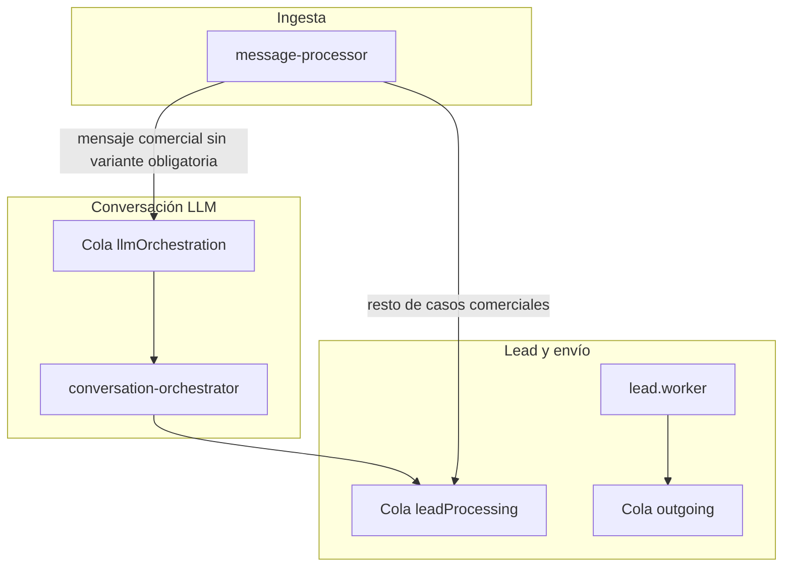

# Pipeline de agentes (leads, conversaciones, ventas)

Este documento describe el flujo actual en producción: qué hace cada worker y qué partes son **deterministas** (reglas, SQL, plantillas) frente a **LLM** (modelo remoto o self-hosted).

## Vista general

## 1. `message-processor` ([`apps/workers/src/message-processor.worker.ts`](../../apps/workers/src/message-processor.worker.ts))

| Fase | Tipo | Descripción breve |
|------|------|---------------------|
| Lock por teléfono | Determinista | Evita carreras entre mensajes del mismo contacto. |
| `intentDetection.detect` | Heurística / reglas | Clasificación inicial del texto. |
| `llmRollout.getPolicy` | Determinista + DB | Activa LLM por tenant, `executionMode` shadow/active, verificador. |
| `productMatcher.matchByMessage` | Determinista + DB | Variante/producto según catálogo y reglas del tenant. |
| `loadLeadMemory` / Prisma | Determinista | Lead, conversación, mensajes. |
| `leadClassifier.classify` | Reglas | Score y status del lead. |
| Reserva de stock (ciertos intents) | Determinista + DB | En **shadow** no se reserva stock en el mismo ramal que en **active** (ver código). |
| Encolado `llmOrchestration` vs `leadProcessing` | Reglas | Si LLM habilitado y el caso no va solo a `lead.worker` por variante/ejes, se encola orquestación. |

**Contrato de salida hacia conversación:** [`LlmOrchestrationJobV1`](../../packages/queue/src/contracts.ts) (incluye `executionMode`, `activeOffer`, `ruleInterpretation`, etc.).

## 2. `conversation-orchestrator` ([`apps/workers/src/conversation-orchestrator.worker.ts`](../../apps/workers/src/conversation-orchestrator.worker.ts))

Orden fijo del pipeline (equivalente a “agentes” nombrados):

1. **Intérprete** — `OpenAiInterpreterService.interpret` (LLM) con fallback; salida tipada `ConversationInterpretationV1`.
2. **Decisor** — `SelfHostedLlmService.decide` (LLM o reglas según configuración); salida `LlmDecisionV1`.
3. **Verificador** — `LlmVerifierService.verify` (LLM o reglas).
4. **Guardrails** — `applyGuardrails` (determinista): bloquea respuestas vacías, ecos, sobre-promesas, etc.
5. **Política** — `resolvePolicyAction` ([`conversation-policy.service.ts`](../../apps/workers/src/services/conversation-policy.service.ts)): en **shadow** la acción ejecutada es `shadow_recommendation_only` (no se ejecutan acciones sensibles como si fueran definitivas).

Persistencia: `ConversationMemory`, `LlmTrace` (reply + verification). Siempre encola **`leadProcessing`** con `interpretation` y `llmDecision` efectivos.

## 3. `lead.worker` ([`apps/workers/src/lead.worker.ts`](../../apps/workers/src/lead.worker.ts))

| Fase | Tipo | Descripción breve |
|------|------|---------------------|
| Consultas SQL variantes/stock | Determinista | Catálogo y contexto de compra. |
| Ramas por intent | Reglas + plantillas | Precio, stock, ejes faltantes, pago, etc. |
| `MercadoPagoPaymentService` | Externo / API | Generación de link de pago cuando aplica. |
| Playbooks adaptativos | Determinista + DB | Puede sustituir el mensaje si no se “conserva” respuesta LLM. |
| Cola `outgoing` | Determinista | Envío del mensaje final al canal. |

En modo **shadow** (ver política LLM en el job): el texto del **draft LLM no se usa como mensaje al cliente**; se sigue el camino de plantillas/playbooks para mantener comportamiento estable mientras se registran trazas y comparaciones opcionales.

## Contratos compartidos

Los tipos canónicos viven en [`packages/queue/src/contracts.ts`](../../packages/queue/src/contracts.ts). Para integraciones externas (p. ej. CrewAI), validar JSON con [`external-agent-contract.ts`](../../packages/queue/src/external-agent-contract.ts) (`parseExternalConversationInterpretation`, `parseExternalLlmDecision`) y, si preferís JSON Schema, exporta `conversationInterpretationV1JsonSchema` y `llmDecisionV1JsonSchema` del mismo módulo.

## Variables de entorno relacionadas

| Variable | Rol |
|----------|-----|
| `LLM_SHADOW_MODE` | Por defecto shadow en rollout ([`llm-rollout.service.ts`](../../apps/workers/src/services/llm-rollout.service.ts)). |
| `LLM_SHADOW_COMPARE_URL` | URL POST a waseller-crew: con ella, por defecto Waseller **delega** interpretación/respuesta al crew (ver [`SINCRONIZACION_CON_WASELLER.md`](../integrations/waseller-crew/SINCRONIZACION_CON_WASELLER.md)). Opt-out: `WASELLER_CREW_DELEGATE_CONVERSATION=false`. |
| `WASELLER_CREW_DELEGATE_CONVERSATION` | `false` desactiva la delegación automática aunque exista `LLM_SHADOW_COMPARE_URL` (p. ej. solo telemetría). Si no está definida, con URL se delega. |
| `LLM_SHADOW_COMPARE_TIMEOUT_MS` | Timeout del POST de comparación. |
| `LLM_SHADOW_COMPARE_SECRET` | Opcional: si está definido, `Authorization: Bearer` en el POST (ver [`CONTRATO_V1_1.md`](../integrations/waseller-crew/CONTRATO_V1_1.md)). |
| `WASELLER_CREW_PRIMARY` | Opcional: `true` — el crew reemplaza la decisión interna antes del verificador (misma URL que shadow-compare); sin segundo POST de comparación en ese turno. |
| `WASELLER_CREW_SOLE_MODE` | Opcional: `true` — **orquestador:** sin intérprete OpenAI ni `SelfHostedLlmService.decide`; stub + POST al crew. **Lead directo:** baseline/interpretación hacia el crew en stub (plantillas locales no definen el baseline del POST). Si el crew no aplica → handoff. Ver [`waseller-crew/README.md`](../integrations/waseller-crew/README.md). |

## Referencia de decisión de runtime

Ver [runtime-choice-crew-vs-langgraph.md](./runtime-choice-crew-vs-langgraph.md) (CrewAI + Python vs LangGraph en TypeScript).
